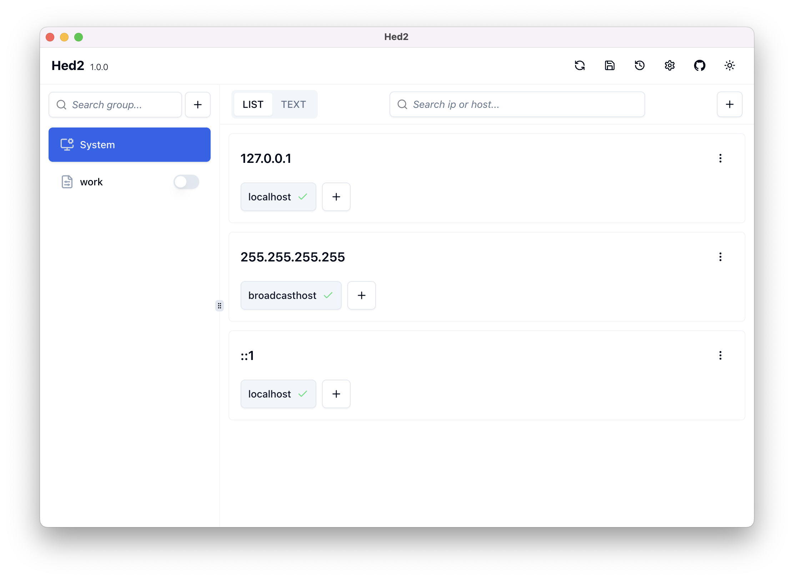
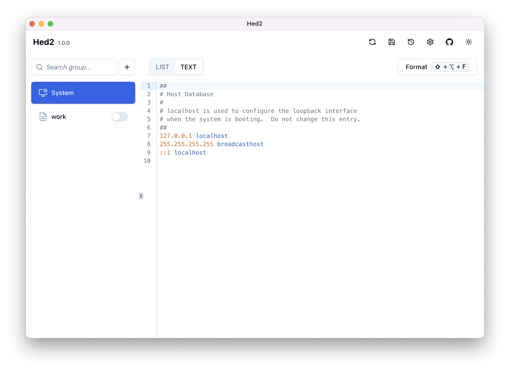
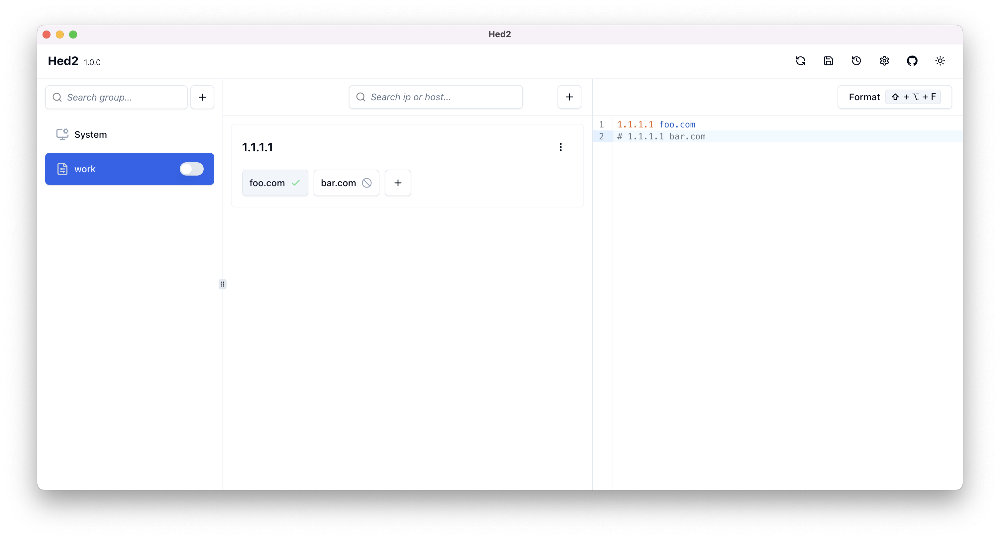
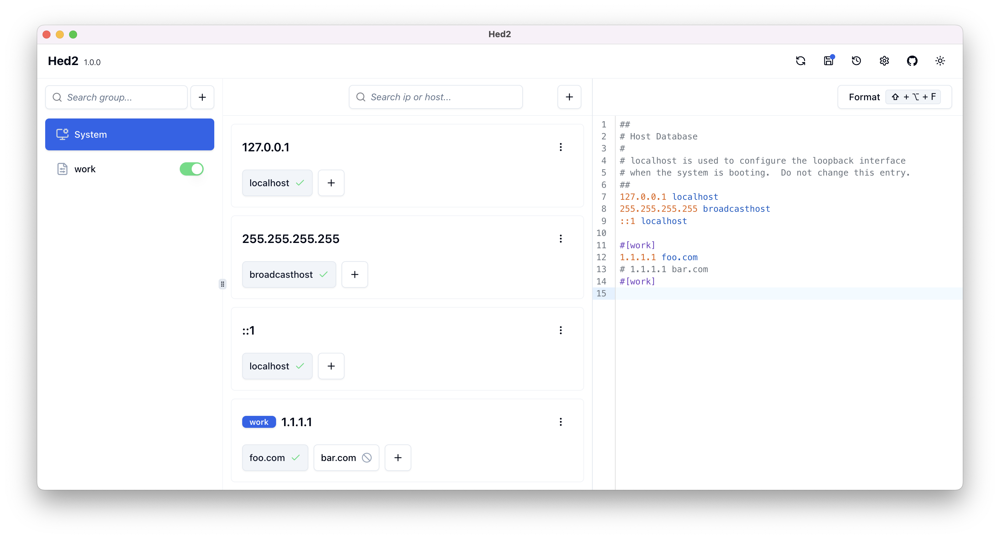
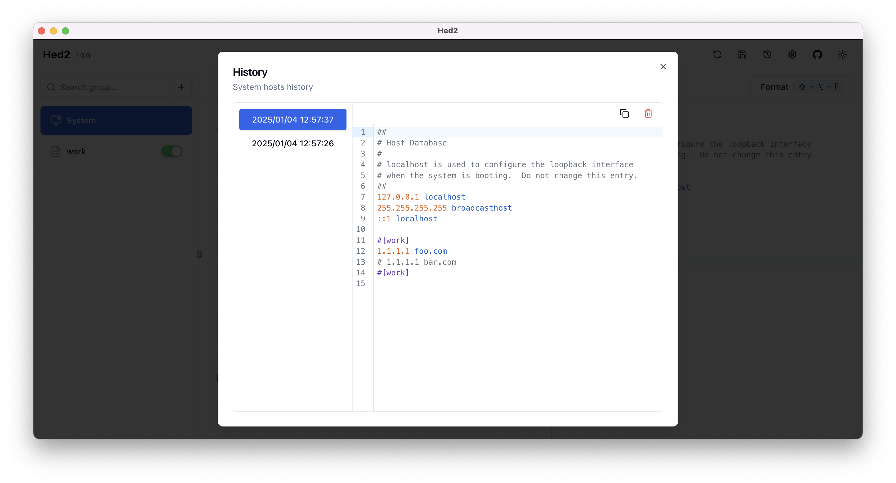
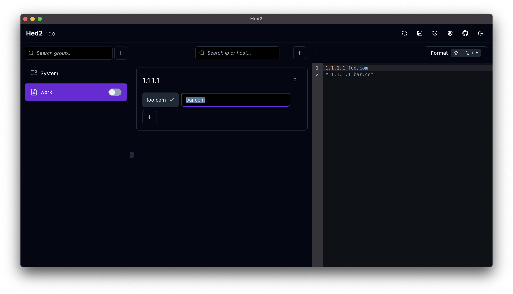

# Hed2

## A hosts file editor desktop client

### Key features

- Support for Windows and MacOs
- Edit hosts via list option or code editor
- Grouping of hosts
- Hosts history
- Light and dark themes

### Installation

[Downlaod latest release](https://github.com/shixinhuang99/hed2/releases)

### Screenshots

